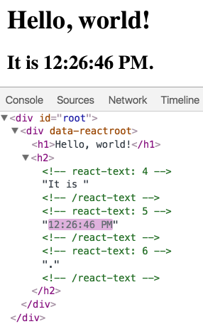

https://codepen.io/gaearon/pen/gwoJeZ?editors=1010

Even though we create an element describing the whole UI tree on every tick, only the text node whose contents have changed gets updated by React DOM.

